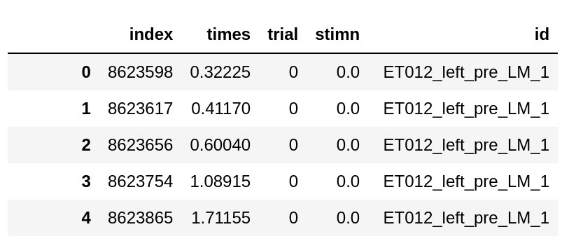

## Neural Connectivity
This project is an implementation to analyse information flows in simultaneous recorded visual areas using directed information(DI). It also included unit-to-unit cross correlation analysis. 

## Requirements 

* Python 3.8 

We can easily create the required Python environment using Conda as follows. 
```
conda create -n <env-name> python=3.8

conda activate <env-name>
```
Replace `<env-name>` with the desired environment name.


## Install Python libraries  
```
pip install -r requirements.txt
```


## Datasets

The datasets used in the analysis were [feather](https://github.com/wesm/feather) files with the format below. 
Each row indicate the spike of a unit at specified time within a given trial. 



* `times` - indicates the spike times in seconds.
* `trial` - the id of the trial 
* `stimn` - the id of stimulus under which the spike was recorded
* `id` - unit id (eg `ET012_left_pre_LM_1` refers to an `LM` unit with id `1` in a "pre" training experiment under a recording with id `ET012_left`) 

# Organization 
Folders 


* `code` - contains the main implementation to identify the directed information(DI) values between neuron groups(layers, cortical areas etc.) 

* `analysis` (and `notebooks/lasso-method` )  -  contain scripts for postprocessing and generating heatmaps and other analysis results


## Steps 
The following commands automate the process required for analysis 


### 1) Preprocessing the datasets 

Preprocessing steps necessary for analysis are compiled under  `preprocessing-notebooks/Explorating data + preprocessing .ipynb`. 


### 2) Creating Configuration files 

The following step create the configuration files necessary for the analysis 

```
cd code 

python create_configuration.py --stimuli 0  --dataset ../../datasets/V1HPC_spks_CQuinn_pre.feather --output_dir ../../V1HPC/output_ --n_recordings 1000000 --output_dir ../../output  --window '500, 1500' --trial_length  3000
python create_configuration.py --stimuli 0  --dataset ../../datasets/V1HPC_spks_CQuinn_post.feather --output_dir ../../V1HPC/output_ --n_recordings 1000000 --output_dir ../../output  --window '500, 1500' --trial_length  3000

python create_configuration.py --stimuli 0  --dataset ../../datasets/V1LP_spks_CQuinn_pre.feather --output_dir ../../V1LP/output_ --n_recordings 1000000 --output_dir ../../output  --window '500, 1500' --trial_length  4000
python create_configuration.py --stimuli 0  --dataset ../../datasets/V1LP_spks_CQuinn_post.feather --output_dir ../../V1LP/output_ --n_recordings 1000000 --output_dir ../../output  --window '500, 1500' --trial_length  4000

python create_configuration.py --stimuli 0  --dataset ../../datasets/V1LGN_spks_CQuinn_pre.feather --output_dir ../../V1LGN/output_ --n_recordings 1000000 --output_dir ../../output --window '500, 1500' --trial_length  4000
python create_configuration.py --stimuli 0  --dataset ../../datasets/V1LGN_spks_CQuinn_post.feather --output_dir ../../V1LGN/output_ --n_recordings 1000000 --output_dir ../../output  --window '500, 1500' --trial_length  4000

python create_configuration.py --stimuli 0  --dataset ../../datasets/V1RSC_spks_CQuinn_pre.feather --output_dir ../../V1LGN/output_ --n_recordings 1000000 --output_dir ../../output  --window '500, 1500' --trial_length  4000
python create_configuration.py --stimuli 0  --dataset ../../datasets/V1RSC_spks_CQuinn_post.feather --output_dir ../../V1LGN/output_ --n_recordings 1000000 --output_dir ../../output  --window '500, 1500' --trial_length  4000

```

The above commands create configuration files  `../../output/runner_<dataset-name>.yml`. These configuration files are used in the subsequent steps. 


### 3) Preprocessing data 

This step transforms the raw data to the expected format in the analysis.  


```
python preprocess_data.py --config <config-path> 
python prefilter_spikes.py --config <config-path> 
python find_active_times.py --config <config-path>
```

### 4) Calculating Directed Information 

```
python lasso_select_parentset.py  --config <config-dir>/runner_config_V1HPC_spks_CQuinn_pre.feather.yml --all-areas hippo v1
python lasso_select_parentset.py  --config <config-dir>/runner_config_V1HPC_spks_CQuinn_post.feather.yml --all-areas hippo v1

python lasso_select_parentset.py  --config <config-dir>/runner_config_V1LGN_spks_CQuinn_pre.feather.yml --all-areas LGN V1
python lasso_select_parentset.py  --config <config-dir>/runner_config_V1LGN_spks_CQuinn_post.feather.yml --all-areas LGN V1

python lasso_select_parentset.py  --config <config-dir>/runner_config_V1LP_spks_CQuinn_pre.feather.yml --all-areas LP V1
python lasso_select_parentset.py  --config <config-dir>/runner_config_V1LP_spks_CQuinn_post.feather.yml --all-areas LP V1

python lasso_select_parentset.py  --config <config-dir>/runner_config_V1RSC_spks_CQuinn_pre.feather.yml --all-areas RSC V1
python lasso_select_parentset.py  --config <config-dir>/runner_config_V1RSC_spks_CQuinn_pre.feather.yml --all-areas RSC V1

```


We run the above three steps for all dataset("pre", "post_9", and "post_15") and all 25 stimuli in each dataset.

### 4) Postprocessing 

The postprocessing scripts aggregate the directed information(DI) results into the plots included in the manuscript. 

* `analysis-notebooks/Post Processing results - XXXX.ipynb` - shows the steps necessary to calculate p values and plot the results in a PDF format. 


### 5) Cross-correlograms 

Create separate configurations for cross-correlogram analysis 


 python create_configuration.py --dataset ../../datasets/V1HPC_spks_CQuinn_pre.feather --stimuli 0  --n_recordings 1000000 --output_dir ../../cross_correlogram/output_  --window '500, 1500' --trial_length  3000 
 python preprocess_data.py --config   /media/yido/additional/research/PurdueZimmerman/cross_correlogram/output__stimuli_0/runner_config_V1HPC_spks_CQuinn_pre.feather.yml 

* create config 
  
  python create_configuration.py --dataset ../../datasets/V1HPC_spks_CQuinn_pre.feather --stimuli 0  --n_recordings 1000000 --output_dir ../../cross_correlogram/output_  --window '500, 1500' --trial_length  4000 